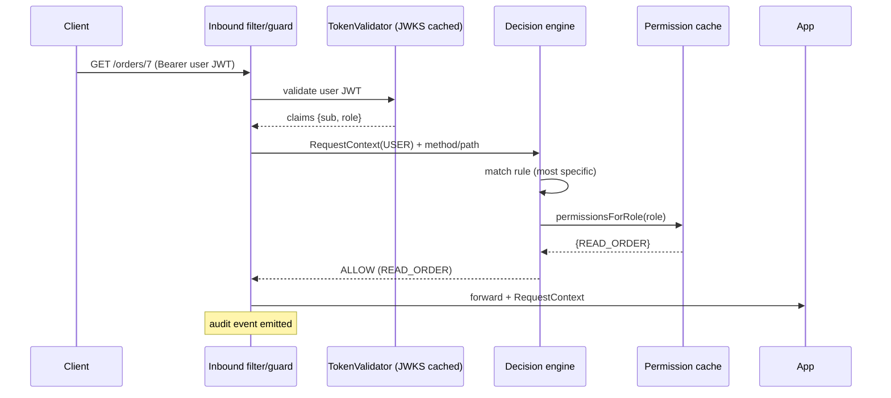
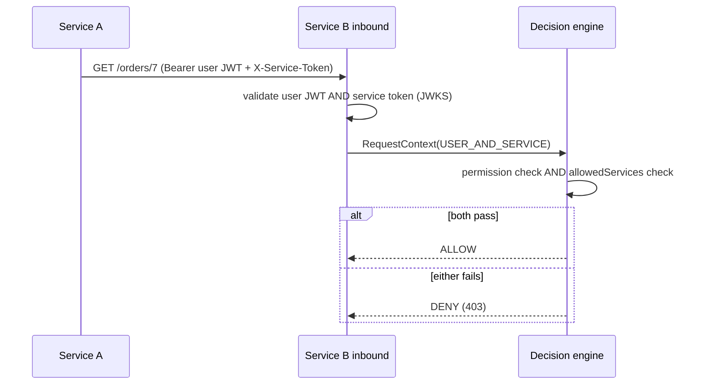
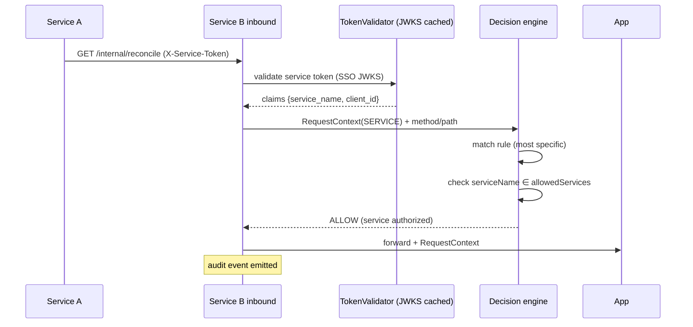

# Authorization Middleware Library — Implementation Architecture

---

## 0. Locked decisions

These three decisions shape the whole design:

1. **Service identity = SSO-issued tokens; user identity = Auth Service tokens.** User JWTs are signed by the local Auth Service; service tokens are signed by the SSO/OIDC provider. The library never signs tokens; it verifies user JWTs against the Auth Service's JWKS and service tokens against the SSO provider's JWKS. Outbound service tokens are obtained via the OAuth2 **client-credentials** grant. The service-identity mechanism sits behind an interface so it can later be replaced by mTLS / Istio without touching authorization logic.
2. **Permission distribution = Role Service (authoritative full state) + Kafka (incremental change events) + local disk (fallback/seed).** *This decision applies only when user auth is enabled (§0.5).* On startup the library calls the Role Service to initialize the cache from confirmed state; Kafka distributes `UPSERT_ROLE` / `DELETE_ROLE` events to keep it current. If the Role Service is unreachable at startup, the library loads the local disk cache (`authorization-cache.json`) to populate the in-memory cache and reports READY from that seed data — or, if no usable (non-empty) disk cache exists, refuses to start rather than serve an empty cache (§8.1). The locally-loaded cache continues to serve until the Role Service becomes available and a full sync succeeds.
3. **Combined request = both must pass.** *This decision applies only when user auth is enabled (§0.5).* A request carrying both a user JWT and a service token is authorized only if the user's role holds the required permission(s) **AND** the calling service is allow-listed.

---

## 0.5 Operating modes

The library can operate in two modes depending on whether user authentication is configured.

### Service-only mode (user auth disabled)

- Only `X-Service-Token` is inspected; `Authorization: Bearer` headers are **ignored** — the library never reads user JWTs
- Only `allowedServices` rules are evaluated; `permissions`/`decision` fields have no effect
- No Role Service, PermissionCache, Kafka sync, or disk cache — the entire role-permission machinery is inactive
- `authenticationType` is always `SERVICE`
- Rules with `permissions` only (no `allowedServices`) always **DENY** at runtime (not a compile error)

### Full mode (user auth enabled)

- Both user JWTs (`Authorization: Bearer`) and service tokens (`X-Service-Token`) are validated against their respective JWKS endpoints
- Full decision matrix applies (§5): `permissions` + `decision` for user requests, `allowedServices` for service requests
- Role Service, PermissionCache, Kafka sync, and disk cache are active
- All `authz.user.*` properties must be configured (all-or-nothing; see §3.3)

---

## 1. Scope and module map

The library provides six capabilities: authentication, authorization, service authentication, permission resolution, context propagation, and audit context. All authorization decisions are made locally, in memory, with no remote authorization call.

Both the Spring and NestJS implementations share this internal module structure. Modules marked with `†` are active **only when user auth is enabled** (§0.5); they are entirely absent in service-only mode.

| Module | Activity | Responsibility |
|--------|----------|----------------|
| `inbound-auth` | always | Validate user JWT + service token; build `RequestContext` |
| `decision-engine` | always | Match rule, resolve permissions, decide allow/deny |
| `rule-config` | always | Load + compile `authorization.yaml` at startup |
| `permission-cache` † | user auth only | In-memory role→permission store; atomic swap |
| `role-service-client` † | user auth only | Fetch full role state from Role Service on startup + reconciliation |
| `cache-sync` † | user auth only | Kafka consumer (incremental events); disk persistence; reconciliation |
| `outbound` | always | Propagate user JWT; attach service token + correlation/request ids | 
| `service-token` | always | Acquire + cache service tokens from SSO (client-credentials) |
| `audit` | always | Emit an audit event per decision |
| `observability` | always | Metrics + health |
| `spi` | always | Extension interfaces (identity, policy, role resolution, sinks) |

---

## 2. Request types and authentication

### 2.1 Token sources

| Type | Header | Principal |
|------|--------|-----------|
| User | `Authorization: Bearer <jwt>` | end user |
| Service | `X-Service-Token: <jwt>` | calling service |
| Combined | both headers | user **and** service |

### 2.2 User JWT validation

*This section applies only when user auth is enabled (§0.5). In service-only mode the `Authorization` header is never read.*

Validate, in order, rejecting on any failure: algorithm (pinned allow-list, `alg: none` rejected), signature (against the Auth Service's JWKS key selected by `kid`), issuer (`iss` == configured `authz.user.issuer`), audience (`aud` contains the configured `authz.user.audience` — **mandatory**; a blank or missing audience configuration is a fail-fast startup error), expiration (`exp`, with ±`clockSkewSeconds` tolerance — **default 5s**, configurable in both libraries).

Extract into the principal: roleId (`roleId` claim — single role), userId (`userId`), JWT id (`jti`).

### 2.3 Service token validation

Service tokens are OAuth2 client-credentials tokens from the same SSO provider. Validate: algorithm, signature (JWKS), issuer, expiration. Distinguish a service token from a user token by a configurable claim (default `token_use == "service"`, or presence of `client_id`). Extract: service name (`service_name`, falling back to `azp`/`client_id`).

A token presented in `X-Service-Token` that resolves to a service **not** known to the SSO provider, or fails any check, is rejected as "unknown service".

### 2.4 RequestContext

After authentication the library builds an immutable `RequestContext` and makes it available to the request scope (Spring: request-scoped bean / `ThreadLocal`; NestJS: attached to the request object and exposed via a parameter decorator). It is the **only** source of identity downstream — see §13 on context-tampering prevention.

```jsonc
RequestContext {
  userId:            string | null,   // always null in service-only mode
  roleId:            string | null,   // always null in service-only mode
  serviceName:       string | null,
  requestId:         string,          // generated if absent
  correlationId:     string,          // propagated if present, else generated
  authenticationType:"USER" | "SERVICE" | "USER_AND_SERVICE",
}
```

`authenticationType` is derived from which validated tokens are present. In service-only mode (§0.5) it is always `SERVICE` — user JWTs are ignored.

---

## 3. Authorization configuration

Authorization is **configuration-driven**. There are no annotations and no authorization logic in business code. Each service owns one `authorization.yaml`, loaded and compiled at startup (route rules are static per deployment; only the role→permission *data* is dynamic via Kafka, and only when user auth is enabled).

### 3.1 Schema

```yaml
# authorization.yaml
rules:
  - path: /orders/**            # ** = deep wildcard (any depth)
    methods: [GET]
    permissions: [READ_ORDER]   # only evaluated when user auth is enabled
    decision: ANY               # ANY | ALL  (default ANY)

  - path: /orders               # exact
    methods: [POST]
    permissions: [WRITE_ORDER, ADMIN]
    decision: ANY               # WRITE_ORDER OR ADMIN

  - path: /orders/*/audit       # * = single segment
    methods: [GET]
    permissions: [READ_ORDER, ADMIN]
    decision: ALL               # READ_ORDER AND ADMIN

  - path: /internal/reconcile
    methods: [POST]
    allowedServices: [scheduler, batch]   # service-only route

  - path: /orders/**
    methods: [*]  # any method type
    permissions: [WRITE_ORDER]
    allowedServices: ["*"]      # any validly-authenticated service

  - path: /public/**
    public: true  # a public path, no validation
    methods: [*]  # any method type
```

- `path` — supports exact, single-segment `*`, and deep `**`.
- `methods` — list of HTTP methods, `*` to fit all methods.
- `permissions` — required permissions. **Only evaluated when user auth is enabled** (§0.5). In service-only mode the field is silently ignored — the rule behaves as if `permissions` were absent.
- `decision` — `ANY` (OR) or `ALL` (AND) over `permissions`. **Only effective when user auth is enabled.**

  > A rule with `permissions` but no `allowedServices` always **DENY** in service-only mode, because the only credential available (`X-Service-Token`) cannot satisfy a permission check — the Bearer header is ignored.

- `allowedServices` — services permitted to call; `"*"` means any authenticated service.
- `public` - boolean(default false), cannot be true with `allowedServices` or `permissions` or `decision` fields.

### 3.2 Startup validation

The config is compiled into an ordered, immutable rule set at startup. Compilation **fails fast** (service does not start) if: an unknown field is present, a `decision` value is invalid, `public` is true with unsupported fields(see §3.1), or two rules are genuinely ambiguous (identical specificity for an overlapping path+method — see §4.2). This turns config mistakes into deploy-time failures rather than runtime security gaps.
On failure the relevant error will be logged, with the reason.

### 3.3 User auth configuration

User authentication is an **optional all-or-nothing** block. When configured, all fields must be present — partial configuration is a fail-fast startup error. When absent, the entire role-permission machinery (§6–§8) is disabled and the library runs in service-only mode (§0.5).

**Spring Boot (`application.yaml`):**
```yaml
authz:
  user:
    issuer: https://auth.example.com
    jwks-uri: https://auth.example.com/.well-known/jwks.json
    audience: my-app
  # role-service-url, kafka-*, etc. are only required when user auth is enabled
```

**NestJS (env vars):**
```
AUTHZ_USER_ISSUER   = https://auth.example.com
AUTHZ_USER_JWKS_URI = https://auth.example.com/.well-known/jwks.json
AUTHZ_USER_AUDIENCE = my-app
```

| Property | Required | Description |
|----------|----------|-------------|
| `authz.user.issuer` | when user auth enabled | Issuer (`iss`) that user JWTs must carry |
| `authz.user.jwks-uri` | when user auth enabled | JWKS endpoint for user-JWT signature verification |
| `authz.user.audience` | when user auth enabled | Expected JWT audience (`aud`) claim for user JWTs |
| `authz.role-service-url` | when user auth enabled | Authoritative Role Service base URL |
| `authz.role-service-connect-timeout` | no | Role Service HTTP connect timeout, default 5000ms |
| `authz.role-service-read-timeout` | no | Role Service HTTP read timeout, default 5000ms |
| `authz.reconcile-interval-ms` | no | Periodic reconciler interval, default 300000ms |
| `authz.disk-cache-path` | no | On-disk role-cache path, default `authorization-cache.json` |
| `authz.kafka-brokers` | no | Kafka brokers for incremental role events; empty disables Kafka |
| `authz.role-updates-topic` | no | Kafka topic for UPSERT events, default `role-updates` |
| `authz.role-delete-topic` | no | Kafka topic for DELETE events, default `role-delete` |
| `authz.publish-roles-topic` | no | Kafka topic for forced-refresh trigger, default `publish-roles` |

All properties under `authz.role-service-*`, `authz.kafka-*`, `authz.disk-cache-*`, and `authz.reconcile-*` are **only validated and wired when user auth is enabled**. In service-only mode they are silently ignored.

---

## 4. Rule matching engine

### 4.1 Matching

For each request the engine finds all rules whose `methods` contains the request method and whose `path` pattern matches the request path, then selects the single **most specific** rule.

`path` Wildcard semantics:
- a literal segment matches only itself,
- `*` matches exactly one segment,
- `**` matches one or more segments (and is only valid as the final segment).

`methods` Wildcard semantics:
- a literal methods names,
- `*` matches all methods.


### 4.2 Most-specific selection

Each pattern is scored segment-by-segment: literal = 2, `*` = 1, `**` = 0. Rules are ordered by comparing segment scores left-to-right; on a tie, the pattern with more total literal segments wins; on a further tie, the longer pattern wins. Example: for `GET /orders/admin/7`, `/orders/admin/**` (scores 2,2,0) beats `/orders/**` (scores 2,0). If two matching rules remain exactly equal, the config is rejected at startup (§3.2).

If **no** rule matches, the result is **DENY**. Missing route coverage is a static-config error, deliberately distinct from the permission-cache failover behaviour in §8.

---

## 5. Decision matrix

The decision logic depends on the active mode (§0.5).

### 5.1 Service-only mode (user auth disabled)

In this mode `authenticationType` is always `SERVICE`. The only check is the service allow-list. Rules with `permissions` but no `allowedServices` always **DENY** — the Bearer header is ignored, so no credential can satisfy a permission check.

| `authenticationType` | Service allow-list check | Allowed when |
|---|---|---|
| `SERVICE` | `serviceName ∈ allowedServices` (or `*`) | service check passes |

Edge case:
- Matched rule has no `allowedServices` → **DENY**.
- Matched rule has `permissions` but no `allowedServices` → **DENY** (rule requires permissions that cannot be satisfied).
- `public: true` → **ALLOW** (no auth required).

### 5.2 Full mode (user auth enabled)

Given the matched rule and the `authenticationType`, the engine decides:

| authenticationType | User permission check | Service allow-list check | Allowed when |
|--------------------|-----------------------|--------------------------|--------------|
| `USER` | evaluate `permissions` + `decision` against role's permissions | — | permission check passes |
| `SERVICE` | — | `serviceName ∈ allowedServices` (or `*`) | service check passes |
| `USER_AND_SERVICE` | evaluate `permissions` + `decision` | `serviceName ∈ allowedServices` (or `*`) | **both** pass |

Edge cases (all deterministic):
- `USER` request, matched rule has no `permissions` (service-only rule) → **DENY** (rule is not user-accessible).
- `SERVICE` request, matched rule has no `allowedServices` → **DENY**.
- `USER_AND_SERVICE` request, rule has `permissions` but no `allowedServices` → **DENY** unless `allowedServices: ["*"]`. The `*` value is the intended escape hatch for "any authenticated service may forward user calls to this route" while still requiring a valid service token.

Permission evaluation:
- `ANY` → role holds at least one of `permissions`.
- `ALL` → role holds every one of `permissions`.

The user's role is resolved to its permission set via the local cache (§6); permissions are never read from the JWT.

---

## 6. Permission resolution and cache

*This section applies only when user auth is enabled (§0.5). In service-only mode there is no permission cache, no role resolution, and no Role Service.*

The JWT carries only the role. The library resolves role → permissions from a local, in-memory cache:

```
MANAGER → { READ_ORDER, DELETE_ORDER }
VIEWER  → { READ_ORDER }
```

Cache properties:
- **Initialized on startup** — on first start the cache is populated from the Role Service. If the Role Service is unreachable, the cache is seeded from the local disk snapshot (see §8.1). The service reports ready once the cache is populated from either source.
- **Atomic replacement** — each update (Role Service response or Kafka event) builds a fresh immutable map which replaces the active reference in one operation (copy-on-replace). In-flight reads always see a complete, consistent map.
- **Read-only access** — callers receive an immutable view; the cache is never mutated in place.

Interface (language-neutral):

```
PermissionCache {
  Set<Permission> permissionsForRole(String role)   // empty set if unknown role
  Instant lastUpdatedAt()
}
```

An unknown role resolves to an empty permission set → the user fails any permission check → DENY (no implicit grants).

---

## 7. Permission distribution

*This section applies only when user auth is enabled (§0.5). In service-only mode all three channels are absent — the library has no role→permission state to distribute.*

The role→permission state reaches the library through three complementary channels with clearly separated responsibilities.

### 7.1 Role Service — authoritative full state

An HTTP service exposes the complete current role→permission map as a bare object (no envelope, no version). The library calls it at startup and during reconciliation to initialize or restore the cache from a guaranteed-consistent state.

```
GET /roles
→ {
    "MANAGER": ["READ_ORDER", "DELETE_ORDER"],
    "VIEWER":  ["READ_ORDER"]
  }
```

### 7.2 Kafka topics — incremental change events

Change events carry **changes only**, not full snapshots, and the operation is conveyed by the **topic** rather than a discriminator field. Two topics are used:

- `role-updates` — insert or fully replace the permission set for one role:

```jsonc
{ "roleId": "manager", "permissions": ["READ_ORDER", "DELETE_ORDER"] }
```

- `role-delete` — remove a role entirely:

```jsonc
{ "roleId": "manager" }
```

Each event is applied to the in-memory cache atomically (copy-the-map-then-swap; §6). Kafka keeps the cache current between Role Service calls; it is **not** the source of truth and is **not** used for cold initialization.

Events that cannot be parsed (missing `roleId`, malformed JSON) are logged as a warning and skipped.

### 7.3 Local disk persistence

`authorization-cache.json` is written to disk every time the in-memory cache changes (after a successful Role Service sync or after each Kafka event is applied). It contains the full role map and timestamp (no versioning):

```jsonc
{
  "timestamp": "2026-06-04T10:00:00Z",
  "roles": {
    "MANAGER": ["READ_ORDER", "DELETE_ORDER"],
    "VIEWER":  ["READ_ORDER"]
  }
}
```

The disk cache is loaded at startup **only if the Role Service is unreachable**. It seeds the in-memory cache to allow the service to become READY and serve traffic. Once the Role Service becomes available, a full sync replaces the disk-seeded data with the authoritative state.

---

## 8. Startup state machine, synchronization, and failover

The startup sequence depends on the operating mode (§0.5). In service-only mode the sequence is trivial because there is no role-permission machinery. In full mode it follows the current deterministic state machine.

### 8.1 Service-only startup

*Active when user auth is not configured.*

```
STARTING
  ↓
Load authorization.yaml
  (fail-fast on config error — §3.2)
  ↓
  → READY
```

No Role Service fetch, no PermissionCache initialization, no Kafka subscription, no reconciler. The service becomes READY immediately after config validation. The global enforcement filter (§12) is registered and serves decisions using only `allowedServices` checks.

### 8.2 Full-mode startup state machine

*Active when user auth is enabled.*

The service follows this deterministic sequence before reporting ready:

```
STARTING
  ↓
Load authorization.yaml
  (fail-fast on config error — §3.2)
  ↓
Fetch full role state from Role Service
  ↓
  Success?
  │
  ├─ Yes ─→ atomic cache replace → write disk cache → Subscribe Kafka → READY
  │
  └─ No  ─→ Load persisted cache from disk
              ├─ disk has a non-empty role map → READY (seed mode) ──→ background retry loop ──→ on success → atomic cache replace → write disk cache → normal mode
              └─ disk missing / unreadable / empty → FAIL FAST (refuse to start)
```

**Seed mode:** If the Role Service is unreachable at startup the library loads the local disk cache (`authorization-cache.json`) to populate the in-memory permission map. The service reports READY with the seed data and continues to serve authorization decisions using this cached snapshot. A background retry loop periodically attempts to contact the Role Service; once it succeeds, the cache is atomically replaced with the authoritative state and the service transitions to normal mode. Metrics indicate seed vs. normal mode for operational visibility.

### 8.3 Kafka event consumer

*This section applies only when user auth is enabled.*

After entering READY the library subscribes to the `role-updates` and `role-delete` topics and processes events as they arrive:

- **`role-updates`** (`{ roleId, permissions }`): copy current map, set the role's permission set, swap reference, write disk cache, update `lastUpdatedAt`.
- **`role-delete`** (`{ roleId }`): copy current map, remove the role, swap reference, write disk cache, update `lastUpdatedAt`.
- **Unparseable event** (missing `roleId`, malformed JSON): log warning, skip, increment `role_event_skipped_total` metric.

Each event is applied individually and atomically. No batching; no reordering. The cache carries no version counter — freshness is tracked by `lastUpdatedAt` (exposed as `permission_cache_age_seconds`).

A third topic, **`publish-roles`**, is a forced-refresh trigger: any message on it
makes the library re-fetch the full snapshot from the Role Service and atomically
replace the cache + disk (identical to the reconciler's re-fetch). It is fail-open
— a failed forced refresh keeps the current cache and increments
`role_refresh_failures_total`.

Each instance subscribes with a **unique consumer group** (`authz-cache-sync-<uuid>`) so
every replica receives every event (broadcast fan-out, not partitioned). Subscription is
also **fail-open at startup**: if the broker is unreachable when the service starts, startup
is *not* aborted — the service serves from the Role Service snapshot / disk seed and the
reconciler (§8.4) heals any events missed until Kafka recovers (`kafkaConsumerConnected`
reports `false` until then).

### 8.4 Reconciliation

*This section applies only when user auth is enabled.*

**Seed-retry loop.** When the service starts in seed mode (Role Service was unreachable), a background loop retries the full snapshot fetch with exponential backoff: 2s, 4s, 8s, then 8s indefinitely until it succeeds. On success it promotes the cache to normal mode and terminates (the periodic reconciler takes over). Errors are logged but do **not** increment `role_refresh_failures_total` — they are expected while the Role Service is recovering.

**Periodic reconciler.** A separate loop (default every 5 minutes) unconditionally re-fetches the full role map from the Role Service (`GET /roles`), atomically replaces the cache, and writes the disk cache. Because the Role Service response carries no version, the re-fetch is unconditional each cycle — a safety net that heals any state missed through consumer lag, rebalance gaps, or event ordering anomalies. It is not the primary update path. Errors increment `role_refresh_failures_total` and the current cache is kept (fail-open).

### 8.5 Failover

*The table below applies only when user auth is enabled. In service-only mode there is no Role Service, no Kafka, and no disk cache — the failover surface is empty.*

| State | Behaviour |
|-------|-----------|
| Role Service reachable at startup | Normal flow: sync → READY |
| Role Service unreachable at startup | Disk cache present & non-empty → READY (seed mode), background retry for full sync; disk missing/unreadable/empty → **fail fast** (refuse to start) |
| Role Service unreachable during reconciliation | Keep current cache; log warning; retry next cycle |
| Kafka unavailable, service already READY | **Fail open** — serve from last-known-good in-memory cache |
| Kafka event fails to parse | Skip event, log warning; cache unchanged |

The "fail open" requirement applies to Kafka — the **change channel** — becoming unavailable while the service is already running with a confirmed cache. At startup, if the Role Service is unreachable, the disk cache provides the seed data needed to serve traffic until the authoritative source can be reached; if no usable (non-empty) disk cache exists, the service **fails fast** (refuses to start) rather than serving an empty cache (§8.2).

---

## 9. Outbound middleware and service tokens

On outbound calls the library automatically:
- **Propagates the user JWT** (`Authorization: Bearer <jwt>`) when the inbound request was a user or combined request — *only when user auth is enabled* (§0.5). In service-only mode no user JWT is available to propagate.
- **Attaches a service token** (`X-Service-Token: <jwt>`) identifying the calling service.
- **Adds correlation id** (`X-Correlation-Id`) from the `RequestContext`.
- **Adds request id** (`X-Request-Id`).

This makes the combined request (user + service) the natural result of one service forwarding a user call to another. Service-to-service forwarding without a user context always uses a service token only.

### 9.1 Service token acquisition

The `service-token` module obtains tokens from the SSO provider via OAuth2 **client-credentials** (the service's own client id + credential, or a workload credential). Tokens are short-lived (5–15 min) and contain service name, issue time, expiry, and token type. The module **caches** the current token and refreshes it proactively before expiry (e.g. at 70% of lifetime), so outbound calls never block on token issuance. On acquisition failure it retries with backoff and surfaces a `ServiceTokenFailures` metric (§10).

The acquisition mechanism is behind a `ServiceIdentityProvider` interface (§11) so a future mTLS/SPIFFE identity can replace SSO client-credentials without changing outbound or authorization logic.


---

## 10. Audit and observability

### 10.1 Audit event

Every authorization decision emits an audit event. Two verbosity levels are emitted at all times — INFO for operational monitoring, DEBUG for full audit pipelines or troubleshooting:

**INFO level** — short one-line summary (always emitted):
```
AUTHZ ALLOW  GET /orders/7       userId=u-123  roleId=MANAGER  perm=READ_ORDER   corr=c-xyz
AUTHZ DENY   POST /orders        userId=u-456  roleId=VIEWER   perm=WRITE_ORDER  corr=c-abc
AUTHZ ALLOW  GET /internal/jobs  svc=scheduler                                 corr=c-def
```

**DEBUG level** — full structured event (configure logger to DEBUG to activate; used by audit pipelines and SIEM):
```jsonc
{
  "timestamp": "2026-06-04T10:00:01.123Z",
  "userId": "u-123",
  "roleId": "MANAGER",
  "serviceName": "scheduler",
  "path": "/orders/7",
  "method": "GET",
  "permission": "READ_ORDER",
  "result": "ALLOW",
  "authenticationType": "USER",
  "requestId": "r-abc",
  "correlationId": "c-xyz"
}
```

The sink is pluggable via an `AuditSink` interface (§11) — default is structured logging; a Kafka sink can be added without code changes elsewhere.

### 10.2 Metrics

Metrics marked with `†` are **only emitted when user auth is enabled**.

| Metric | Type |
|--------|------|
| `authz_success_total` | counter |
| `authz_failure_total` | counter |
| `authz_permission_denied_total` | counter |
| `jwt_validation_failures_total` | counter |
| `service_token_failures_total` | counter |
| `role_event_skipped_total` † | counter |
| `role_refresh_failures_total` † | counter |
| `disk_cache_write_failures_total` † | counter |
| `permission_cache_age_seconds` † | gauge |

Failure-metric scope (both libraries):
- `jwt_validation_failures_total` — **user JWT** validation failures only (not emitted in service-only mode).
- `service_token_failures_total` — **service-token** failures, both inbound validation
  (a presented `X-Service-Token` that fails any check) and outbound client-credentials
  acquisition (§9.1).
- `authz_failure_total` — request rejected before a decision (e.g. no credentials presented).
- `authz_permission_denied_total` — a rule matched but the decision was DENY.

### 10.3 Health

A health indicator reports the following fields. Fields marked with `†` are **only present when user auth is enabled**.

| Field | Type | Description |
|-------|------|-------------|
| `cacheStatus` † | string | `"initialized"` or `"empty"` |
| `cacheAgeSeconds` † | integer | Seconds since last cache write |
| `mode` † | string | `"NORMAL"` or `"SEED"` |
| `roleServiceLastSync` † | string \| null | Last successful `GET /roles` timestamp |
| `kafkaConsumerConnected` † | boolean | Whether Kafka consumer is running |

In service-only mode the health indicator reports only basic service reachability; cache-related fields are absent.

---

## 11. Extension interfaces / SPI

All future capabilities slot in behind these interfaces, so no service code changes are needed to adopt them. Interfaces marked with `†` are **only wired when user auth is enabled**.

| Interface | Today | Future |
|-----------|-------|--------|
| `TokenValidator` | Auth Service JWKS (user JWT) + SSO JWKS (service token) | additional issuers |
| `ServiceIdentityProvider` | SSO client-credentials token | mTLS / SPIFFE / Istio identity |
| `RoleResolver` † | wired via `AuthorizationEngine.authorizeWithResolver()`; defaults to `PermissionCache`-backed resolution | multiple roles, role hierarchy, multi-tenant role mapping |
| `PolicyEngine` | wired as `AuthorizationEngine` (compiled rule set + `DecisionEvaluator`) | OPA / central policy |
| `AttributeProvider` | interface defined; no wired implementation yet | ABAC attributes |
| `RoleServiceClient` † | HTTP Role Service fetch | pluggable source |
| `CacheEventHandler` † | Kafka UPSERT/DELETE events | other event streams |
| `AuditSink` | structured log | Kafka / SIEM |

`authenticationType`, `RequestContext`, and the decision API are stable contracts; swapping any implementation behind these interfaces leaves business services untouched.

---

## 12. Framework integration

### 12.1 Spring Boot

- A `OncePerRequestFilter` registered **globally** in the `SecurityFilterChain` (covering all routes) runs authentication, builds the `RequestContext`, and invokes the decision engine. On deny it short-circuits with `403`. There is no per-controller annotation.
- Outbound propagation via auto-registered `RestClient` and `RestTemplate` interceptors (a `ClientHttpRequestInterceptor` added through `RestClientCustomizer`/`RestTemplateCustomizer` when an outbound identity is configured). `WebClient`/WebFlux is not bundled.
- `RequestContext` exposed via the request-scoped `AuthzRequestContext` bean, which also carries the raw user JWT for outbound propagation (the JWT is kept off the `RequestContext` record so its schema — §2.4 — is unchanged).

### 12.2 NestJS

- A global guard registered via `APP_GUARD` in the root module performs authentication + decision for every route; a global middleware builds the `RequestContext` first. No per-route decorators for authorization.
- Outbound propagation via an axios request interceptor registered with `attachOutboundPropagation(...)` (or `authz.attachOutbound(...)`). The inbound context is carried across the async call chain by `AsyncLocalStorage`, established by the Express `createAuthz` middleware or, on the Nest path, by `AuthzOutboundInterceptor` (registered after the guard).
- `RequestContext` exposed via a custom parameter decorator.

Global registration in both frameworks means a developer must actively fight the framework to bypass authorization (closes the "advisory" gap).

---

## 13. Security

Rejections: invalid JWT, expired JWT, invalid service token, unknown service, missing required permission — each returns `401` (authentication) or `403` (authorization) and increments the relevant metric.

Threat controls:
- **Permission bypass** — global enforcement (§12); no-match → DENY (§4); unknown role → empty permissions → DENY (§6).
- **Service spoofing** — service tokens verified against the SSO JWKS; an unsigned or wrongly-signed `X-Service-Token` is rejected; service identity is taken only from validated token claims.
- **Context tampering** — the `RequestContext` is built **only** from validated token claims. Any inbound `X-User-*`, `X-Role`, `X-Correlation-Id`/`X-Request-Id` headers are not trusted as identity; identity headers are stripped/ignored and only correlation/request ids are accepted as opaque trace values (never as authorization inputs).

Performance: every decision is memory-only — no database access, no remote authorization call. JWKS keys and service tokens are cached; Kafka is asynchronous and off the request path.

---

## 14. Cross-language correctness (Spring + NestJS)

The two implementations must behave identically on every authorization decision. This is enforced by a **shared contract test suite**: a language-neutral set of vectors — `authorization.yaml` fragments + request (method, path, tokens, role, permissions, services) + expected decision — that both the Java and TypeScript builds run in CI. No release of either library ships unless it passes the full vector set. The vectors cover wildcard precedence, decision modes, every cell of the §5 matrix, and edge cases (no match, unknown role, `*` service, missing dimensions).

---


## Appendix A — Sequence flows

**Service-only request (user auth disabled — §0.5)**
```mermaid
sequenceDiagram
  participant C as Client
  participant F as Inbound filter/guard
  participant V as TokenValidator (SSO JWKS cached)
  participant E as Decision engine
  participant A as App
  C->>F: GET /internal/reconcile (X-Service-Token)
  F->>V: validate service token (SSO JWKS)
  V-->>F: claims {service_name, client_id}
  F->>E: RequestContext(SERVICE) + method/path
  E->>E: match rule (most specific)
  E->>E: check serviceName ∈ allowedServices
  Note over E: permissions/decision fields ignored;<br/>rules with permissions only always DENY
  E-->>F: ALLOW (service authorized)
  F->>A: forward + RequestContext
  Note over F: audit event emitted
```

**User request (full mode — user auth enabled)**


**Combined request (both must pass)**


**Service request (service-to-service, no user)**

